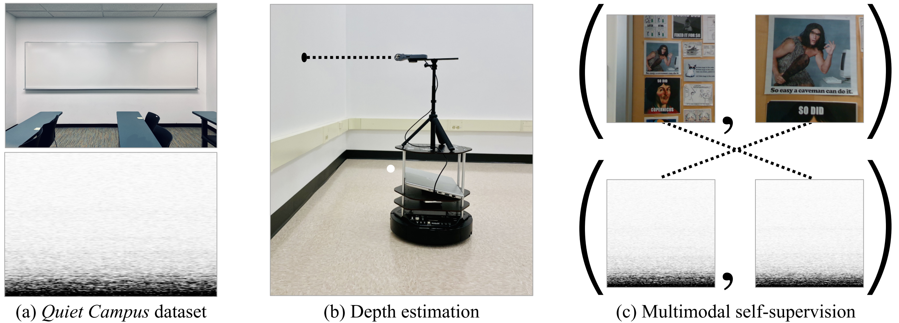

Structure from Silence: Learning Scene Structure from Ambient Sound
==================================================================
<h4>
Ziyang Chen*, Xixi Hu*, Andrew Owens
</br>
<span style="font-size: 14pt; color: #555555">
University of Michigan
</span>
</br>
CoRL 2021 (Oral)
</h4>
<hr>

This repository contains the official codebase for [Structure from Silence: Learning Scene Structure from Ambient Sound](https://arxiv.org/abs/2111.05846). [[Project Page](https://ificl.github.io/structure-from-silence/)]

<div align="center">
  
</div>


## Environment
To setup the environment, please simply run

```bash
conda env create -f environment.yml
conda activate SFS
```


## Quiet Campus Dataset

#### Static Recordings
We collected `Static recording` data in 46 classrooms from 12 buildings on The University of Michigan’s campus, amounting to approximately 200 minutes audio. Inside each classroom, we selected 16 − 30 positions and recorded 10 secs. of audio at each one.  The camera and microphone are pointed toward the nearest wall when recording so that the distance is well-defined. Our data can be downloaded from [Here](https://www.dropbox.com/s/nywn5pn3jxga71l/SFS-Static-Dataset.tar.gz?dl=0). You can simply download this processed dataset by running

```bash
cd Dataset/SFS-Static
sh ./download_static.sh
```

#### Motion Recordings
We collected `Motion recording` data with approximate 90 minutes of videos
in motion (222 videos total). During recording, the microphone and RGB-D camera move toward or away from a wall. Our data can be downloaded from [Here](https://www.dropbox.com/s/idtfza0q9iwv923/SFS-Motion-Dataset.tar.gz?dl=0). You can simply download this processed dataset by running

```bash
cd Dataset/SFS-Motion
sh ./download_motion.sh
```

## Model Zoo

We release several models trained with our proposed methods and our collected dataset. We hope it could benefit our research communities.

| Model      | Dataset  |     url    | 
|:----------:|:--------:|:----------:|
| static-obstacle-detection    |  Static Recording        |[url](https://www.dropbox.com/s/pxl3cba6yp78eqd/static-obstacle-detection.pth.tar?dl=0)    |
| static-relative-depth-order  |  Motion Recording        |[url](https://www.dropbox.com/s/vvv1olmr2pai8li/static-relative-depth.pth.tar?dl=0)    |
| motion-obstacle-detection    |  Motion Recording        |[url](https://www.dropbox.com/s/bnveghppa6ni0az/motion-obstacle-detection.pth.tar?dl=0)    |
| motion-relative-depth-order  |  Motion Recording        |[url](https://www.dropbox.com/s/f3sgck397vwxpv8/motion-relative-depth.pth.tar?dl=0)    |
| AV-order-pretext  |  Motion Recording     | [url](https://www.dropbox.com/s/satqr3feervivc2/motion-avorder.pth.tar?dl=0)    |


To download all the checkpoints, simply run

```bash
sh ./scripts/download_models.sh
```

## Train & Evaluation
We provide training and evaluation scripts under `scripts`, please check each bash file and run `chmod +x xx.sh` before running it.

#### Training 
- Training obstacle detection model on Static recordings, run: 
  ```bash
  ./scripts/training/train-static-obstacle.sh
  ```

- Training relative depth order model on Static recording, run: 
  ```bash
  ./scripts/training/train-static-relative-depth.sh
  ```

- Training obstacle detection model on Motion recordings, run: 
  ```bash
  ./scripts/training/train-motion-obstacle.sh
  ```

- Training relative depth order model on Motion recording, run: 
  ```bash
  ./scripts/training/train-motion-relative-depth.sh
  ```

- Training AV-Order model on Motion recording, run: 
  ```bash
  ./scripts/training/train-motion-avorder.sh
  ```

- To perform linear probing experiment on downstream tasks, here is an example for relative depth order task:
  ```bash
  CUDA_VISIBLE_DEVICES=0 python main_lincls.py --exp='Audio-LinCLS-relative-depth' \
    --epochs=40  --setting='av_lincls_RD' --input='audio' \
    --batch_size=256 --num_workers=8 --save_step=1 --valid_step=1 --lr=0.01 \
    --optim='SGD' --repeat=50 --schedule='cos' --aug_wave --freeze \
    --resume='pretrained-models/motion-avorder.pth.tar'
  ```


#### Evaluation
- To evaluate our `static-obstacle-detection` model, simply run: `./scripts/test/test-static-obstacle.sh` under parent path. You can change the checkpoint in the bash file.
- To evaluate our `static-relative-depth-order` model, simply run: `./scripts/test/test-static-relative-depth.sh` under parent path. You can change the checkpoint in the bash file.
- To evaluate our `motion-obstacle-detection` model, simply run: `./scripts/test/test-motion-obstacle.sh` under parent path. You can change the checkpoint in the bash file.
- To evaluate our `motion-relative-depth-order` model, simply run: `./scripts/test/test-motion-relative-depth.sh` under parent path. You can change the checkpoint in the bash file.


## Citation

If you find our project useful, please consider citing:

```text
@inproceedings{
    chen2021structure,
    title={Structure from Silence: Learning Scene Structure from Ambient Sound},
    author={Ziyang Chen and Xixi Hu and Andrew Owens},
    booktitle={5th Annual Conference on Robot Learning },
    year={2021},
    url={https://openreview.net/forum?id=ht3aHpc1hUt}
}
```

## Acknowledgment
This work was funded in part by DARPA Semafor and Cisco Systems. The views, opinions and/or findings expressed are those of the authors and should not be interpreted as representing the official views or policies of the Department of Defense or the U.S. Government.